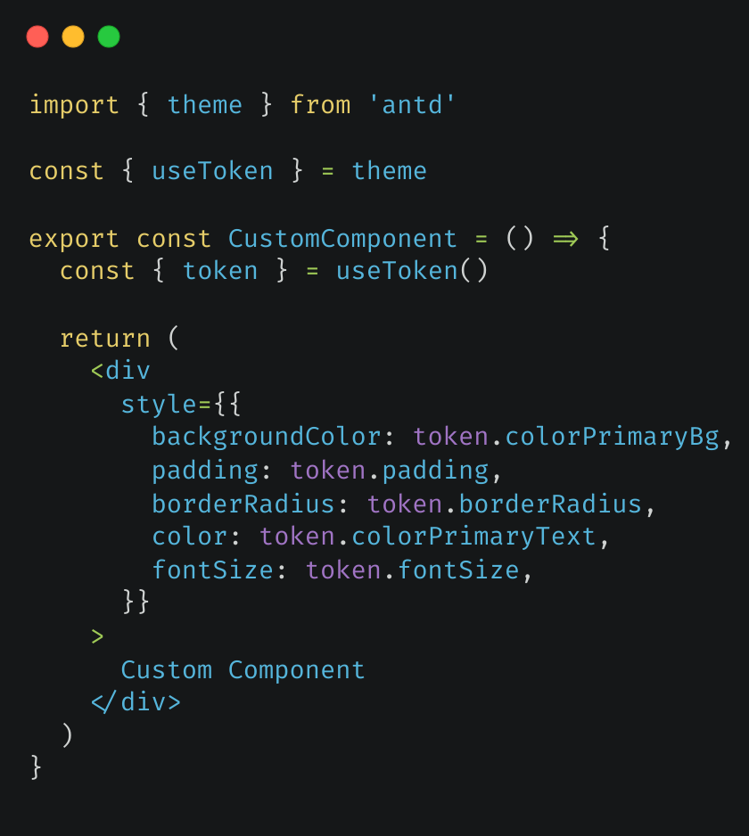
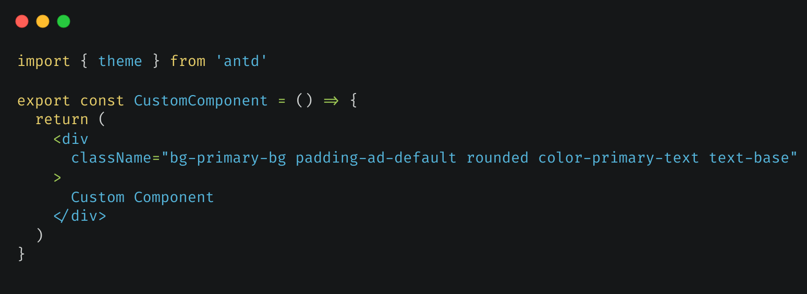

# tailwindcss-antdesign-preset

Make [ant design tokens](https://ant.design/docs/react/customize-theme#seedtoken) to a tailwindcss theme config [preset](https://ant.design/docs/react/customize-theme-cn#seedtoken).

## Result

| Before                        | After                       |
| ----------------------------- | --------------------------- |
|  |  |

## Usage

Run the command:

```sh
npm i --save-dev tailwindcss-antdesign-preset
```

Add to tailwind.config.{ts|js}

Use the default theme:

```js
const config = {
  presets: [require('tailwindcss-antdesign-preset')()],
  // ...other settings
}
```

Use custom theme:

```js
const config = {
  presets: [require('tailwindcss-antdesign-preset')(customTheme)],
  // ...other settings
}
```

## Default preset

Look at the [sample file](./src/sample.js)

## Available configs

### Override

These ant design tokens override tailwindcss theme default values:

| Ant Design                 | TailwindCSS Config                        | Example Usage |
| -------------------------- | ----------------------------------------- | ------------- |
| variant colors(blue, etc.) | theme.color.\*.{ [variant(1-10)]: color } | `color-blue`  |
| fontSize\*                 | theme.fontSize.\*                         | `text-sm`     |
| borderRadius\*             | theme.borderRadius.\*                     | `rounded-md`  |
| screen\*                   | theme.screens.\*                          | `sm:`         |

### Extend

These ant design tokens extend tailwindcss theme config:

| Ant Design                   | TailwindCSS Config         | ad-default |
| ---------------------------- | -------------------------- | ---------- |
| extend colors(colorBg, etc.) | theme.extend.color.\*      |            |
| padding\*                    | theme.extend.padding.\*    | v          |
| margin\*                     | theme.extend.margin.\*     | v          |
| size\*                       | theme.extend.size.\*       | v          |
| boxShadow\*                  | theme.extend.boxShadow.\*  | v          |
| lineHeight\*                 | theme.extend.lineHeight.\* | v          |

ad-default: you need use such as `padding-ad-default` for ant design default value(padding)
